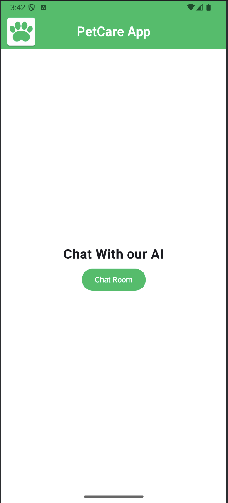
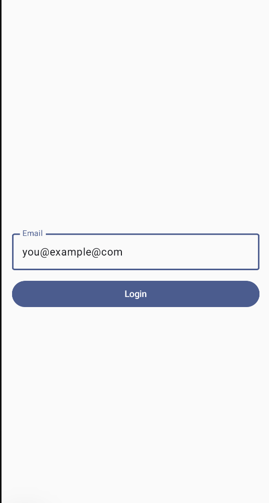
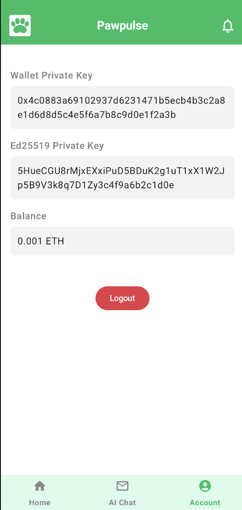

## Android Version of the PetCare App

Preventive Healthcare Android App

### Screenshots

<table align="center">
  <tr>
    <td align="center">
       
      <b>Home Screen</b>
    </td>

   <td align="center">
       
      <b>Login Screen</b>
    </td>
  
  </tr>

</table>

<table align="center">
  <tr>
  <td align="center">
       
      <b>Chat Screen</b>
    </td>

 
    <td align="center">
       
      <b>Account Screen</b>
    </td>

  </tr>

</table>

### High Level System Diagram

