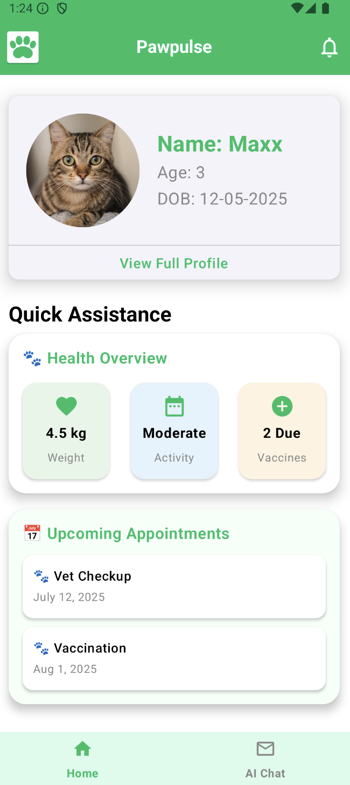
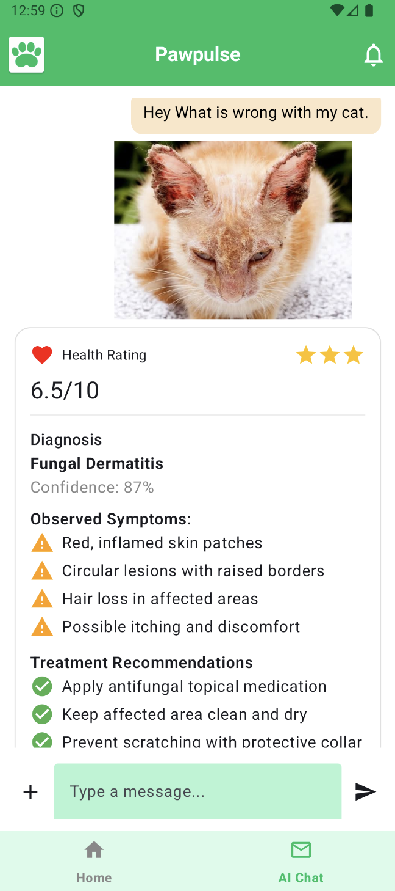

## Android Version of the PetCare App

PawPulse is an Android application that combines AI-driven preventive pet healthcare with seamless Web3 wallet integration to create a smart, user-friendly platform for pet owners. The app simplifies access to AI health insights while enabling blockchain-powered features like identity and future asset management, all without requiring users to understand Web3 complexities.
### Screenshots

<table align="center">
  <tr>

 <td align="center">
       
      <b>Login Screen</b>
    </td>

    

   <td align="center">
       
      <b>Home Screen</b>
    </td>
  
  </tr>

</table>

<table align="center">
  <tr>
  <td align="center">
       
      <b>Chat Screen</b>
    </td>

  <td align="center">
       
      <b>Account Screen</b>
    </td>
 
    

  </tr>

</table>

### High Level System Diagram

